As a user from the access group *Administration / Settings*, in debug mode, go to *Settings / Technical / Actions / Server Actions* and create a new *Server Action.*
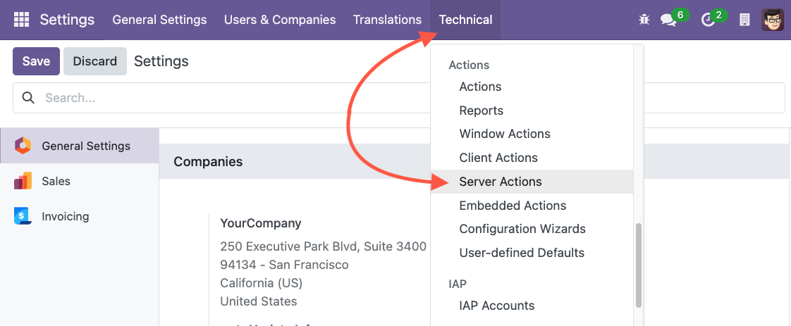

In the field *Type,* choose the new option *Mass Edit Records*. 
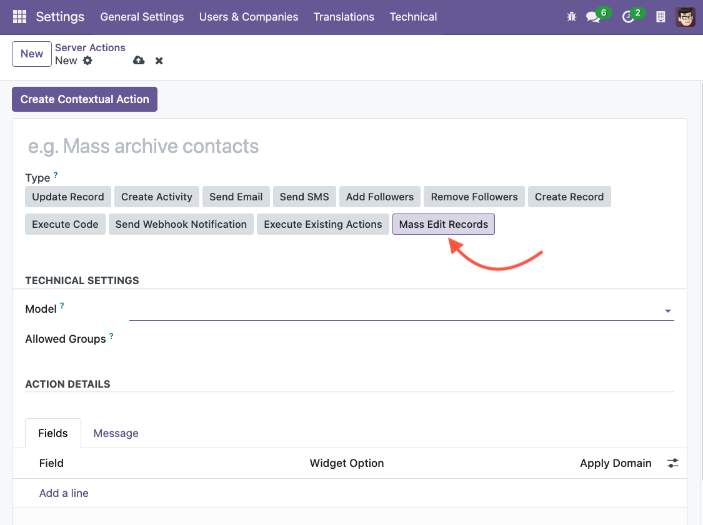

Select the model on which you want to configure this action and give a name to your server action.

TIP\!   
Name your action “*Mass Edit : Object Functional Name*”   
E.g. *Mass Edit : Contact (or Partner)*
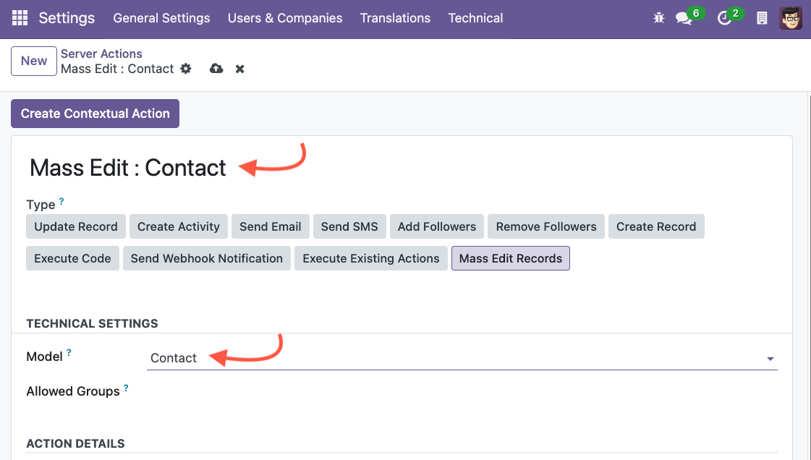

Add the fields you want to be able to edit.

You can search and filter all the fields available by clicking on *Search more.*
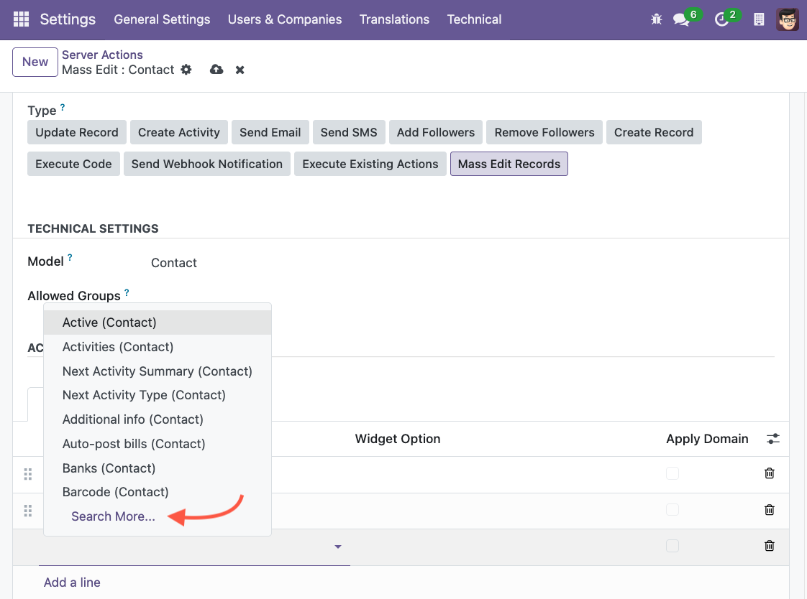
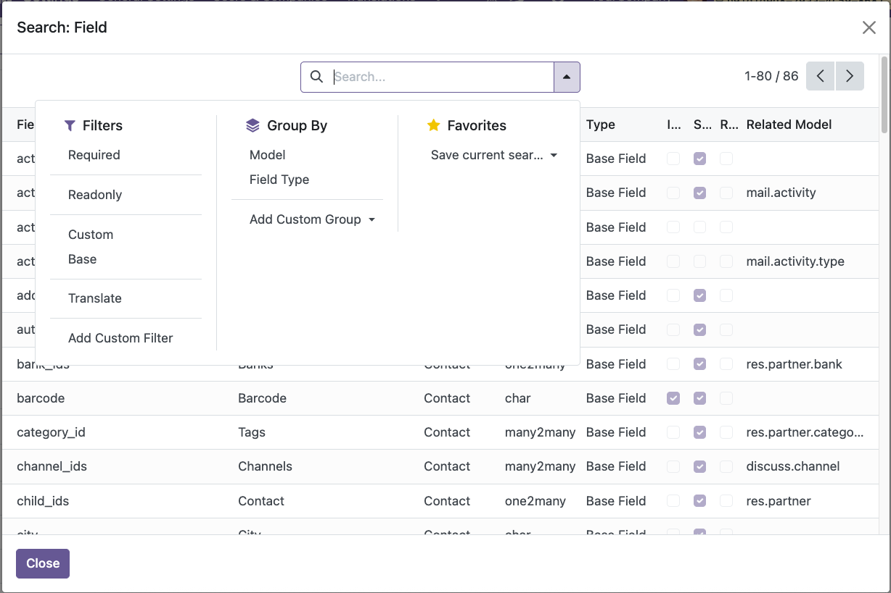

Click on *Create Contextual Action* to add the Mass Editing action in the *Action* menu.
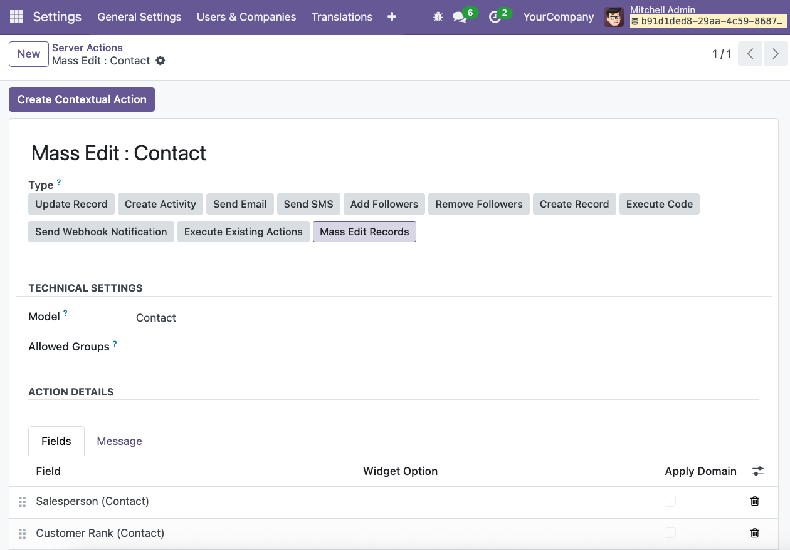

## Widget Option

This option allows you to choose the widget to be used in the Mass Editing Action Window.
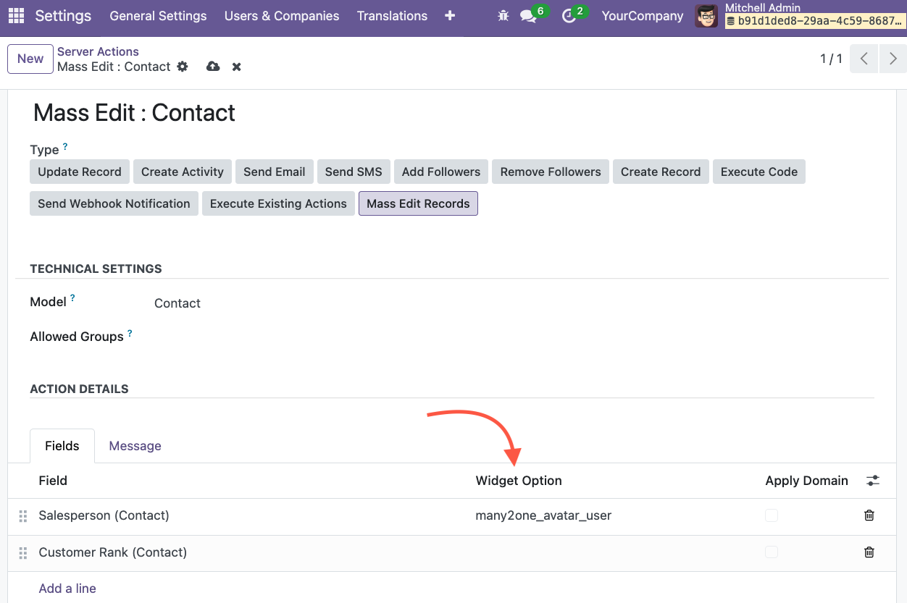

## Apply Domain

This option allows you to apply the default Domain related to the selected field.
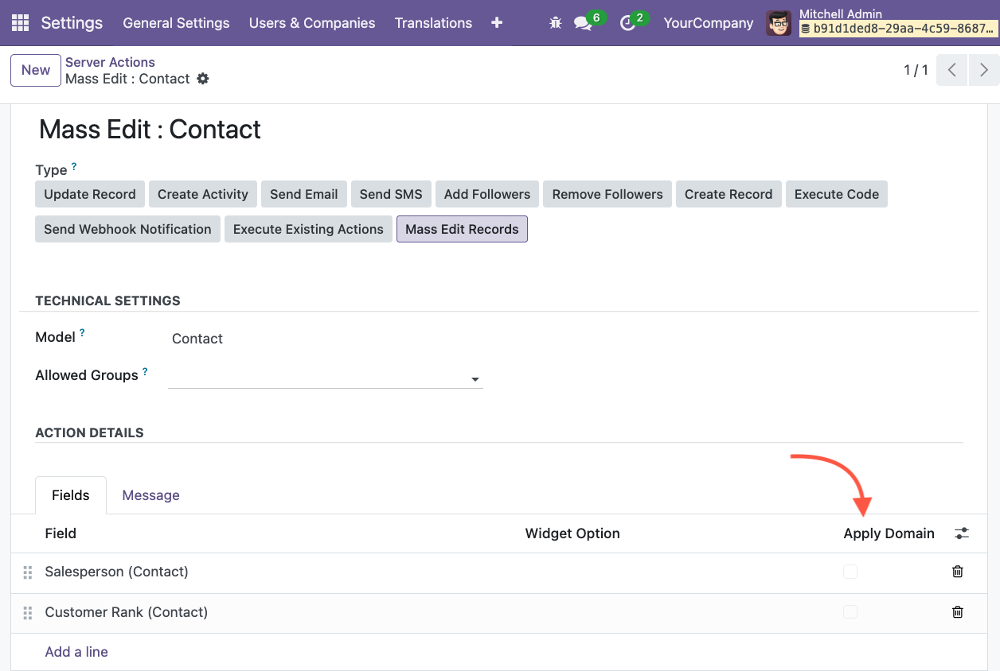

### Adding a Message

You can add a *“Message”* to guide the users when using this action. 
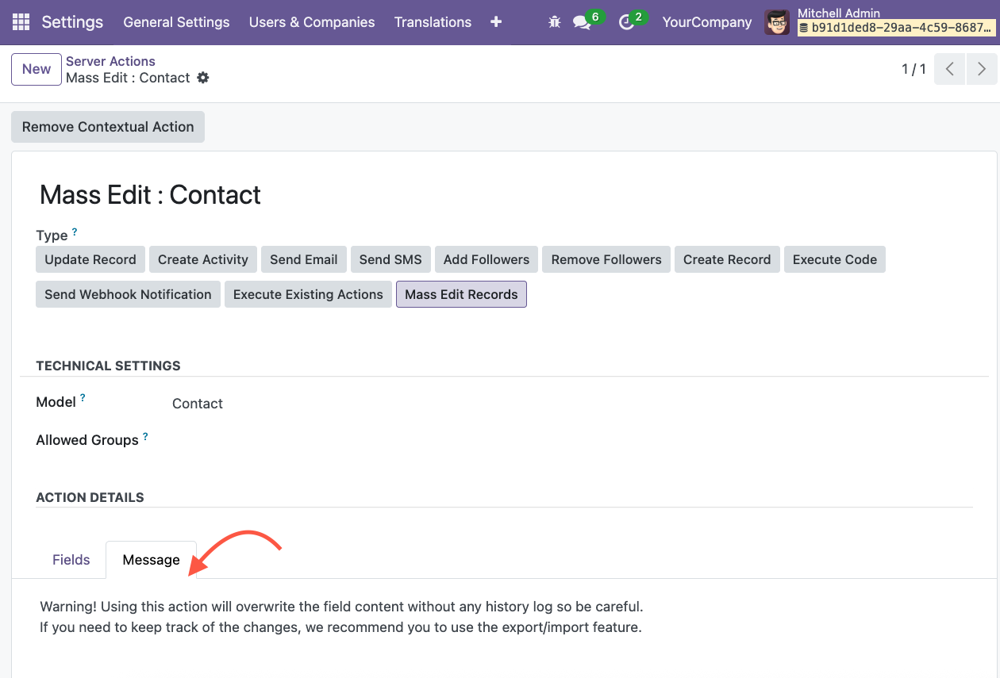

## Adding security access group

Go to the field *Allowed Groups* and add the Access Group(s) who can use this action.
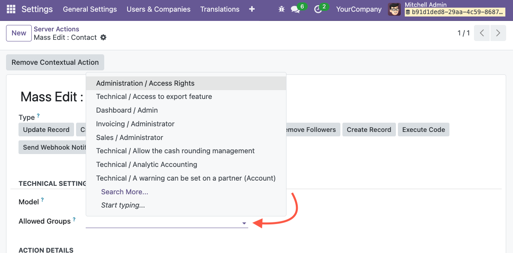
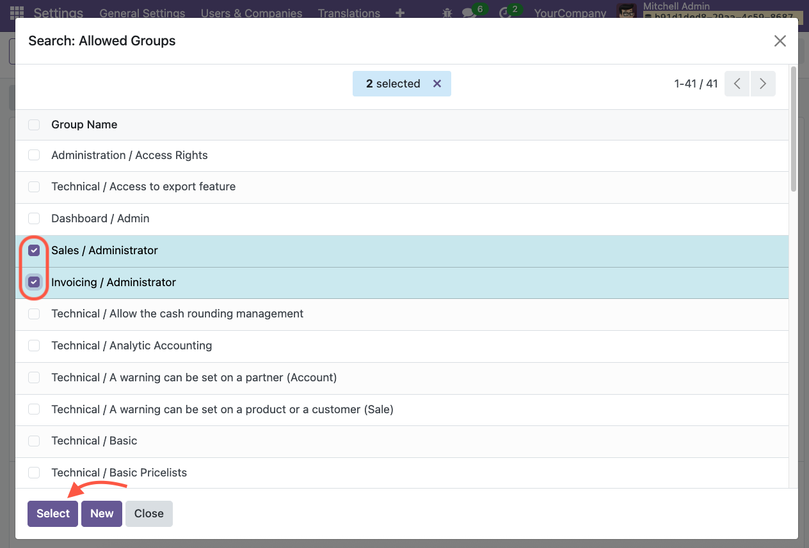
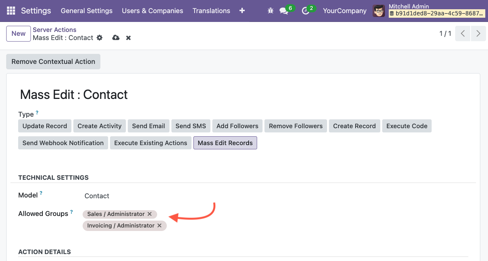

Now, only users from those groups will be able to see and use this action.