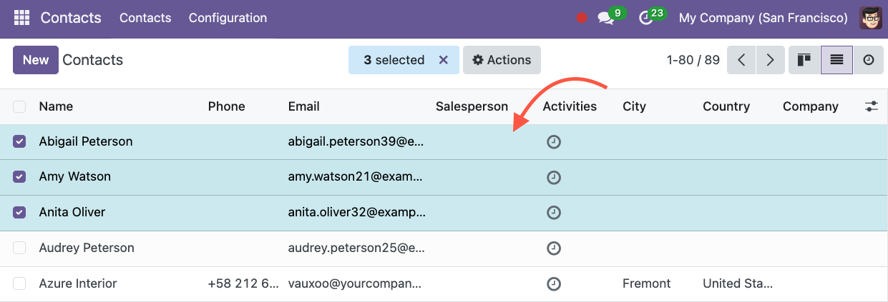
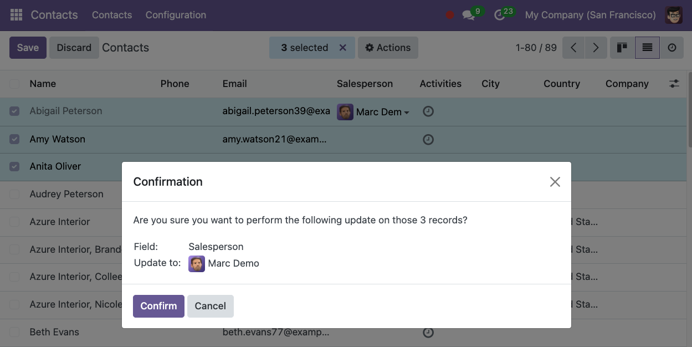
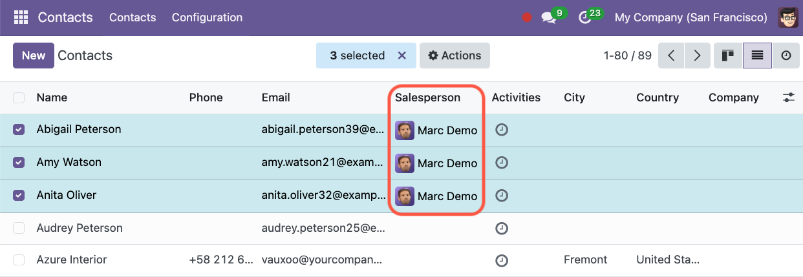

## Context

### Difference in comparison to the Odoo Feature**

Since Odoo V13, a limited *Mass Editing* feature is available in Odoo CE.

In the list view, when selecting multiple records, you can edit a field. Then, the system will ask you if you want to apply those changes on all selected records.

This module provides the following extra features :

* Mass edit *many fields* in a single action  
* Add an access group to the *Mass Edit Action* to limit the usage of this action to specific users.  
* Filter the records the user can mass update  
* Mass edit any fields with any widget. (For example color fields, image fields, etc...)

## Use Case

It can be useful to be able to edit the value of one or more fields on multiple records at the same time easily.

For example, if I want to identify some contacts as *Customers,* I need to change the value of the field `customer_rank` from 0 to 1\. This field is not visible on the form view of a *Contact* so the only way to do it (without this module) would be to export the list and import the edited file.

Another example would be to give access to specific users, using access groups, to mass edit some fields on the invoices.