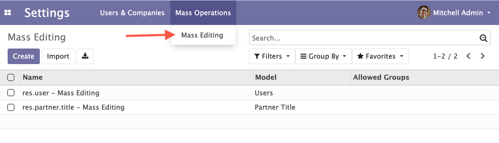

## V11 to V13 Access

The module was previously named `mass_editing` (from v6.1 to version 15)
See : https://odoo-community.org/shop/mass-editing-1568?search=mass_editing#attr=5526

From version 16+, it is named `server_action_mass_edit` 
See: https://odoo-community.org/shop/mass-editing-11388?search=server_action_mass_edit#attr=22115

### Access to the feature in V11 to V13

As a user from the access group *Administration / Settings*, go to *Settings / Mass Operations / Mass Editing.*

